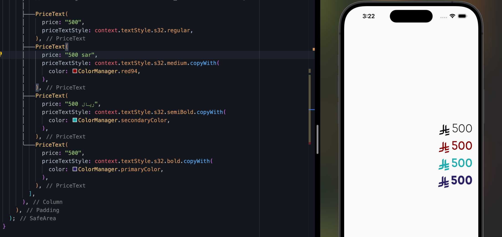

# Riyal Price Preview Widget

Use this widget to display prices with the new Saudi Riyal identity. Follow the steps below to integrate and test the widget.

---

## Steps

### 1. Add the Riyal Font
Place the Riyal font file (e.g., `riyal.ttf`) in your project's `fonts` folder.

### 2. Declare the Font in `pubspec.yaml`
Add the following declaration to your `pubspec.yaml` file to register the Riyal font:

```yaml
flutter:
  fonts:
    - family: Riyal
      fonts:
        - asset: assets/fonts/riyal.ttf
```
## 3. Use the RiyalPriceText Widget

The `RiyalPriceText` widget allows you to display prices with or without currency notation. It supports various input formats, such as:

- `"500"`
- `"500 SAR"`
- `"500 ريال"`

### Example Usage

```dart
RiyalPriceText(
  price: "500",
  style: TextStyle(fontSize: 24, color: Colors.blue),
),
RiyalPriceText(
  price: "1000 SAR",
  style: TextStyle(fontSize: 30, fontWeight: FontWeight.bold),
),
RiyalPriceText(
  price: "750 ريال",
  style: TextStyle(fontSize: 20, color: Colors.green),
),
```
## Or just use the extension (withRiyalPrice) on Text Widget
```dart
Text(
              "100",
              style: TextStyle(color: ColorManager.primaryColor, fontSize: 20),
            ).withRiyalPrice()
```
### Example Output

# "500" → Displays as "500 ريال"
# "1000 SAR" → Displays as "1000 ريال"
# "750 ريال" → Displays as "750 ريال"

## if you wnat to use icons in Text use this 
[fluttericonGenerator](https://www.fluttericon.com)


## Preview
